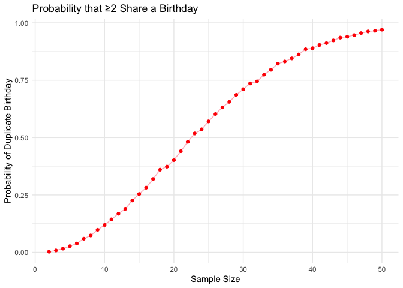
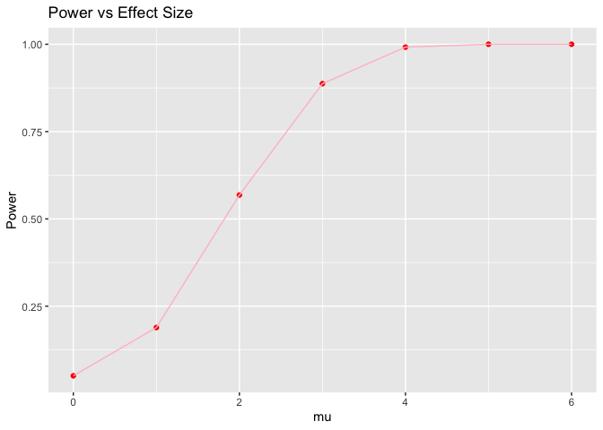
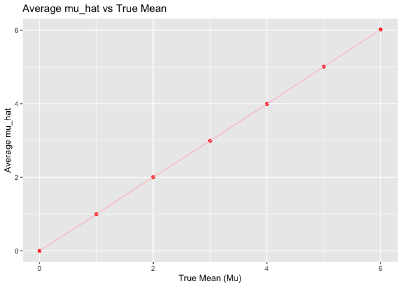
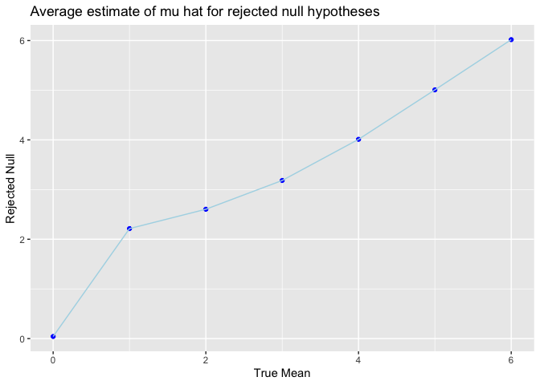
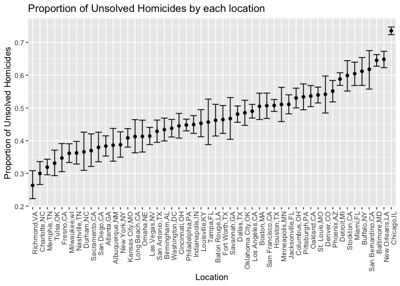

p8105_hw5_mnw2132
================
Mary Williams
2024-11-15

# Set up

``` r
library(tidyverse)
```

    ## ── Attaching core tidyverse packages ──────────────────────── tidyverse 2.0.0 ──
    ## ✔ dplyr     1.1.4     ✔ readr     2.1.5
    ## ✔ forcats   1.0.0     ✔ stringr   1.5.1
    ## ✔ ggplot2   3.5.1     ✔ tibble    3.2.1
    ## ✔ lubridate 1.9.3     ✔ tidyr     1.3.1
    ## ✔ purrr     1.0.2     
    ## ── Conflicts ────────────────────────────────────────── tidyverse_conflicts() ──
    ## ✖ dplyr::filter() masks stats::filter()
    ## ✖ dplyr::lag()    masks stats::lag()
    ## ℹ Use the conflicted package (<http://conflicted.r-lib.org/>) to force all conflicts to become errors

``` r
library(ggplot2)
library(rvest)
```

    ## 
    ## Attaching package: 'rvest'
    ## 
    ## The following object is masked from 'package:readr':
    ## 
    ##     guess_encoding

``` r
library(broom)
```

# Problem 1

### Create the function

``` r
#Create the function
birthday_data<-function(sample_size) {
  bday<- sample(1:365, sample_size, replace = TRUE)
  any(duplicated(bday))
}
```

``` r
# Run the function
sim_bday= 
  tibble(
    sample_size = 2:50) %>%
  mutate(
    output_lists = map(.x = sample_size, ~rerun(10000, birthday_data(.x))), 
    estimate_df= map_dbl(output_lists, ~mean(unlist(.)))
) %>%
  select(sample_size, estimate_df)
```

    ## Warning: There was 1 warning in `mutate()`.
    ## ℹ In argument: `output_lists = map(.x = sample_size, ~rerun(10000,
    ##   birthday_data(.x)))`.
    ## Caused by warning:
    ## ! `rerun()` was deprecated in purrr 1.0.0.
    ## ℹ Please use `map()` instead.
    ##   # Previously
    ##   rerun(10000, birthday_data(.x))
    ## 
    ##   # Now
    ##   map(1:10000, ~ birthday_data(.x))

### Graph the function

``` r
sim_bday %>%
  ggplot(aes(x = sample_size, y = estimate_df)) +   geom_line(color = "light pink") +  geom_point(color = "red") + 
  labs(
    x = "Sample Size",
    y = "Probability of Duplicate Birthday",
    title = "Probability that ≥2 Share a Birthday") + 
theme_minimal()
```

<!-- -->

# Problem 2

``` r
set.seed(1)

#Create the function 
t_test = function(n = 30, mu = 0, sigma = 5) {
  sim_test = tibble(
    x = rnorm(n, mean = mu, sd = sigma))
  
  test_result = t.test(sim_test$x, mu = 0)
  tidy_result = tidy(test_result)
  
  tibble(
    mu_hat = mean(sim_test$x),
    p_value = tidy_result$p.value
  )
}

t_test(30)
```

    ## # A tibble: 1 × 2
    ##   mu_hat p_value
    ##    <dbl>   <dbl>
    ## 1  0.412   0.629

``` r
sim_results = map_dfr(c(0, 1, 2, 3, 4, 5, 6), function(mu) {
  map_dfr(1:5000, ~ t_test(n = 30, mu = mu, sigma = 5)) %>%
  mutate(true_mu = mu)
})
```

``` r
results_df = bind_rows(sim_results)
```

## Plot 1: Plot of power vs True mean

``` r
plot_1 = results_df %>%
  group_by(true_mu) %>%
  summarize(power = mean(p_value < 0.05))

ggplot(plot_1, aes(x = true_mu, y = power)) +
  geom_point(color = "red") + 
  geom_line(color = "pink") + 
  labs(x = "mu", 
       y = "Power", 
    title = "Power vs Effect Size")
```

<!-- --> The
association between effect size and power is a positive association that
follows a sigmoid shape. An effect size of 0 has a power of a little
over 0, and then effect size of 6 approaches 1.

## Plot 2: Plot of mu_hat vs true mean

``` r
average_mu_hat = results_df %>%
  group_by(true_mu) %>%
  summarize(average_mu_hat = mean(mu_hat))

ggplot(average_mu_hat, aes(x = true_mu, y = average_mu_hat)) +
  geom_point(color = "red") +
  geom_line(color = "pink") +
  labs(x = "True Mean (Mu)",
       y = "Average mu_hat",
       title = "Average mu_hat vs True Mean")
```

<!-- -->
Considering that the graph is a straight line from (0,0) to (6,6), this
means that accross all of the simulations, the estimate of the sample
mean is very close to the true mean. \## Plot 3: Plot of mu_hat for
regeected null hypothesis

``` r
rejected_df = results_df %>%
  filter(p_value < 0.05) %>%
  group_by(true_mu) %>%
  summarize (avg_rejected = mean(mu_hat))
```

``` r
ggplot(rejected_df, aes(x = true_mu, y = avg_rejected)) +
       geom_point(color = "blue") +
         geom_line(color = "light blue") +
         labs(x = "True Mean",
              y = "Rejected Null",
              title = "Average estimate of mu hat for rejected null hypotheses")
```

<!-- --> For the
rejected null graph, unlike the first graph, there is some variation in
the point position. Specifically, for a true mean of 0, the rejection is
negative, and for 1, the rejected null is about 2.5. This demonstrates
that for smaller effect sizes or true means, there is a higher chance of
failing to reject a false null hypothesis.

# Problem 3

### Load info

``` r
homicide_df = read.csv("data/homicide-data.csv")
summary(homicide_df)
```

    ##      uid            reported_date       victim_last        victim_first      
    ##  Length:52179       Min.   : 20070101   Length:52179       Length:52179      
    ##  Class :character   1st Qu.: 20100318   Class :character   Class :character  
    ##  Mode  :character   Median : 20121216   Mode  :character   Mode  :character  
    ##                     Mean   : 20130899                                        
    ##                     3rd Qu.: 20150911                                        
    ##                     Max.   :201511105                                        
    ##                                                                              
    ##  victim_race         victim_age         victim_sex            city          
    ##  Length:52179       Length:52179       Length:52179       Length:52179      
    ##  Class :character   Class :character   Class :character   Class :character  
    ##  Mode  :character   Mode  :character   Mode  :character   Mode  :character  
    ##                                                                             
    ##                                                                             
    ##                                                                             
    ##                                                                             
    ##     state                lat             lon          disposition       
    ##  Length:52179       Min.   :25.73   Min.   :-122.51   Length:52179      
    ##  Class :character   1st Qu.:33.77   1st Qu.: -96.00   Class :character  
    ##  Mode  :character   Median :38.52   Median : -87.71   Mode  :character  
    ##                     Mean   :37.03   Mean   : -91.47                     
    ##                     3rd Qu.:40.03   3rd Qu.: -81.76                     
    ##                     Max.   :45.05   Max.   : -71.01                     
    ##                     NA's   :60      NA's   :60

The raw data includes information about the ID, information about the
report like date, information about the victum like name, race, age and
sex. And then location information like city, state and latitude,
longitude, and disposition.

### Create location variable

``` r
homicide_df = homicide_df %>%
  mutate(location = paste(city, state, sep = ","))
```

### Homicides in each city

``` r
city_summary = homicide_df %>%
  group_by(location) %>%
  summarize(
    total_homicides = n(),
    unsolved_homicides = sum(disposition %in% c("Closed without arrest", "Open/No arrest"))
  )

print(city_summary)
```

    ## # A tibble: 51 × 3
    ##    location       total_homicides unsolved_homicides
    ##    <chr>                    <int>              <int>
    ##  1 Albuquerque,NM             378                146
    ##  2 Atlanta,GA                 973                373
    ##  3 Baltimore,MD              2827               1825
    ##  4 Baton Rouge,LA             424                196
    ##  5 Birmingham,AL              800                347
    ##  6 Boston,MA                  614                310
    ##  7 Buffalo,NY                 521                319
    ##  8 Charlotte,NC               687                206
    ##  9 Chicago,IL                5535               4073
    ## 10 Cincinnati,OH              694                309
    ## # ℹ 41 more rows

There are some cities that have less than 10 \### Baltimore, MD

``` r
baltimore_data = city_summary %>%
  filter(location == "Baltimore,MD")

baltimore_prop = prop.test(baltimore_data$unsolved_homicides, baltimore_data$total_homicides)
baltimore_results = broom::tidy(baltimore_prop) %>%
  select(estimate, conf.low, conf.high)
```

### Estimate proportions

``` r
city_summary = city_summary %>%
  filter(total_homicides >2) %>%
  mutate(
    prop_test = map2(unsolved_homicides, total_homicides, ~prop.test(.x, .y) %>% 
    tidy()),
    estimate = map_dbl(prop_test, "estimate"),
    conf.low = map_dbl(prop_test, "conf.low"),
    conf.high = map_dbl(prop_test, "conf.high")
  )
```

### Plot proportion estimates for CI

``` r
ggplot(city_summary, aes(x = reorder(location, estimate), y = estimate)) + 
  geom_point() + 
  geom_errorbar(aes(ymin = conf.low, ymax = conf.high)) +
  labs(x = "Location", y = "Proportion of Unsolved Homicides", title = "Proportion of Unsolved Homicides by each location") + 
    theme(axis.text.x = element_text(angle = 90, hjust = 1))
```

<!-- -->
